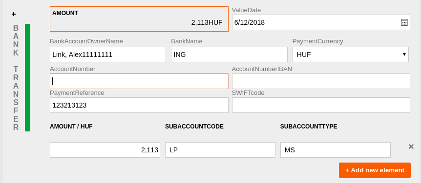

# Custom input formatting

  
###
The Pega7 platform as of now does not provide any out-of-the-box solution for real-time input formatting. Using custom javascript could help you reach your desired functionality.

  

In our use case, we needed user input fields that could format bank account numbers, IBAN numbers and SWIFT codes automatically. While the user is able to add and remove these fields.

  

So, we created a simple demo that shows how we created our solution using the Cleave.js external library, for additional information please visit [their github repository](https://nosir.github.io/cleave.js/).

### 1. Include Cleave.js in your Pega application

Create a new text file with .js extension.

As Cleave.js requires copyright and license notice, first download their license and copy it to the top of your newly created javascript file. You can find their license [here](https://github.com/nosir/cleave.js/blob/master/LICENSE).

  

Since Pega can only work with javascript files locally, download Cleave.js itself and copy it to the same file. You can download Cleave.js from [here](https://github.com/nosir/cleave.js/blob/master/dist/cleave.js).

  

Save the file and now you only have to add it to your harness to use it.

  

Open your Perform harness, navigate to Scripts & Styles tab and add your new javascript file. If you are using multiple javascript files, please pay attention to their order.

### 2. Customisation

First, create your section and input fields that need to be formatted. Then in the text input's settings go to Presentation and click on Advanced Presentation options.

Here under Cell read-write classes option, you can define a selector for your field that will be used later on in your javascript code.

  

Create a second javascript file, this will contain your code to customise the input fields.

The key to including your customisation in Pega is to use the selectors that you added previously in your section.

  

Now, you only have to create your code. If your requirements aren't that complicated here is a basic formatting for static bank account number text input.

    var example = new Cleave('.example-selector’, {  
		blocks: [ 8, 8, 8],
		numericOnly: true,
		delimiter: "-”  
    });

  

For guidance please check Cleave's [documentation](https://github.com/nosir/cleave.js/blob/master/doc/options.md).

  

In our application, there were multiple input fields that were added and removed dynamically during runtime. For this, we used the MutationObserver interface that provides the ability to watch for changes being made to the DOM tree. Please visit their [website](https://developer.mozilla.org/en-US/docs/Web/API/MutationObserver) for more information.

  

If you are interested, you can check our solution under [here](scripts/inputformatter.js).

  

There is only one remaining step, you should include your custom javascript file in the Perform harness the same way you did with the first file. Once again, please pay attention to the files order.

  

And now you finished, your section is ready to be tested.

  

#### We hope that this short tutorial was helpful and you have reached your goal.

