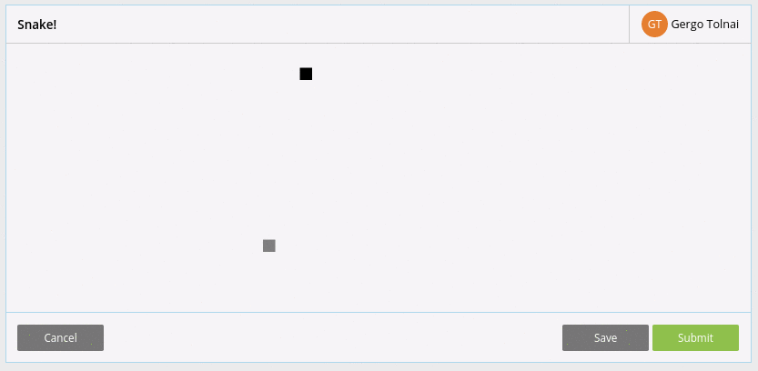
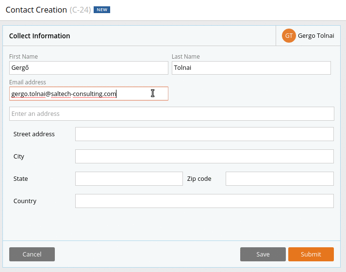
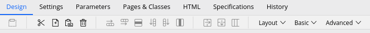
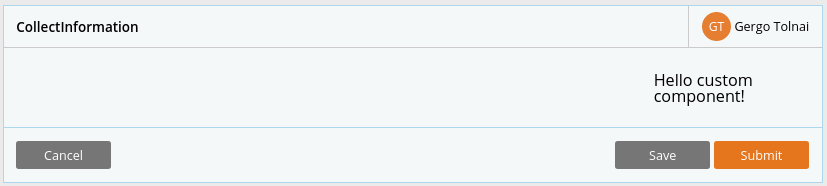
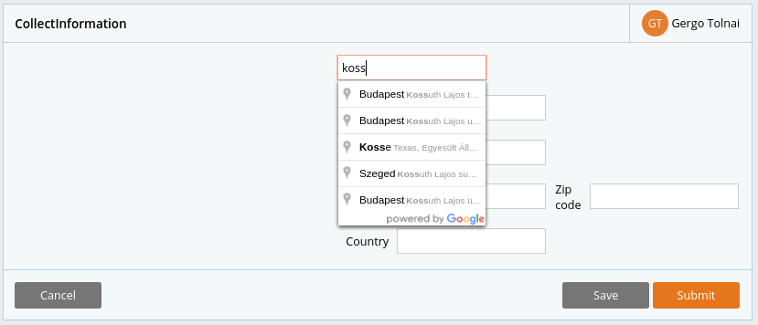
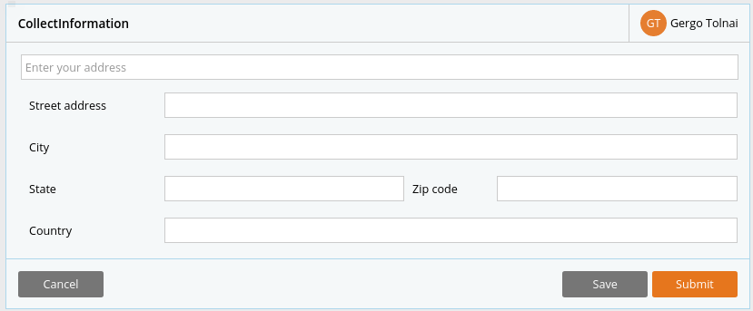

# Custom UI elements in Pega

The Pega7 platform offers a wide range of built in User Interface elements (like autocomplete, rich text editor, charts), but what if you would like to include something that cannot be easily achieved with the default building blocks?  

Pega offers the possibility for you to write custom frontend code. Using this feature you can create a component which lets users... play snake!


Of course you can use these features for more serious purposes too. Think for example of UI components that leverage publicly available APIs (Application Programming Interfaces) to help your users during their work.

In this post we will build a custom UI component that lets the users to select addresses with the help of Google Maps data.

The end result will look something like this:



## Creating a custom UI component in Pega

From now on the article switches to a more in depth, tutorial style, showing how you can create you own custom UI element in Pega. We will be creating the previously shown Address Autocomplete component.

Pega offers two main modes of creating a custom UI component:

- customizable Controls
- customizable Sections  

Controls are best to use if you want to be able to modify and persist a single property. One of their neat features is that our custom controls can be included in the "authoring menus" (these are the Basic and Advanced menus in the edit Section screen).  



### Setup

For the Address Autocomplete we will customize a section, because we would like to persist more than one property (eg. .pyCity, .pyCountry, etc. on the Data-Address-Postal class).

#### Step 1: create a section on the Data-Address-Postal class

**Task:** Create a section on the Data-Address-Postal class and name it AddressAutocomplete.

#### Step 2: add simple HTML to your section

Navigate to the _HTML_ tab of the edit section screen.    
Uncheck the checkbox "Auto-generated HTML"  
Uncheck the checkbox "Omit extra spaces"  
Check the checkbox "Speciality component"  

This will fill the code editor with some pre-configured code. Feel free to delete it.

Add the following to the HTML source:

```HTML
<h1> Hello custom component! </h1>
```

Save the section.

#### Step 3: include the newly created section on a case screen

Create a property named Address of type Single Page and of page definition Data-Address-Postal on the case that you want to include our custom UI element.  
On a section of the case, use section include with the following setup:
- Page context: Use clipboard page
- Class: Data-Address-Postal
- Clipboard page: .Address
- Section: By name: AddressAutocomplete

After starting you case you should see something similar:



Note: if nothing appears on the screen it can be that .Address is not present on the clipboard. If this is the case, edit the case's pyDefault data transform to set the .Address.pyLabel property to an empty string.

#### Step 4: obtain a Google maps API key

Follow the instruction of [this](https://pdn.pega.com/using-address-map-control) PDN article to get a Google Maps API key.

### Creating the component

After we have the basics set up, lets head to the fun part!
In this section we will implement the functionality previously shown on the gif.

#### Step 1: Setup address auto-completion

Copy the content of this [gist](https://gist.github.com/geritol/33de8553ecd0308771c559c00d64f570) to your custom component (AddressAutocomplete).  
This will provide you a starting base.   
Note: this code is a slightly modified version of Google's [tutorial](https://developers.google.com/maps/documentation/javascript/examples/places-autocomplete-addressform).

The autocomplete is not working yet, and the HTML might be displayed oddly if you run the case, but we will fix this shortly.

You can save the identifier of the speciality component to a Java variable named ```componentID``` using the following JSP tag. followed by a Java expression:
```HTML
<pega:save name="componentID" ref="Param.pzComponentId" />
<% String componentID = tools.getSaveValue("componentID"); %>
```

We will need this, so we can uniquely identify our component even if multiple of them are on the same screen.

Insert the previous lines to the top of the file, followed by this statement:
```HTML
<% String containerID = "address-autocomplete_" + componentID; %>
```
We can now use the variable ```containerID```to get the identifier of our main HTML element, and ```componentID``` to get the speciality component's ID.

Now we can set up the auto-completion by inserting the following code at the end of our file.

```HTML
<script>
/* SpecialtyComponent requires div having id speciality_<pega:reference name="param.pzComponentId"/> in order to work properly */
if(document.getElementById('<%= containerID %>')) {
		pega.u.d.registerAsHarnessElement({
			 /* onLoad function will be run on load of the page and can be use to initialize the special control with default values from clipboard properties */
			 onLoad : initAutocomplete
		},pega.u.d.getContainerSectionElement('<%= containerID %>'));
}
</script>
```

This registers our component as a harness element, and calls the ```initAutocomplete``` function to enable the autocompleting search.

If you head to your case, the autocompleting search should work.
The case should be resembling this:

  

Your code should be similar to [this](https://gist.github.com/geritol/697a66e0a0e1caa9422f81623385108b).

#### Step 2: fixing display issues

As you might have noticed, our section is taking up only half of the space. This is caused by a ```div``` automatically included by Pega.

This can easily be fixed by adding the following code to our component:

```HTML
<script>
  var unneededElement = document.getElementById('speciality_<%= componentID %>')
  unneededElement.parentNode.removeChild(unneededElement)
</script>
```

Cool! Now your component should be able to fill up the whole space it is provided.  

#### Step 3: adding some style

Our ```input``` fields are a little bit small. Let's make them bigger with some CSS!

Add the following code to your component:

```HTML
<style>
#<%= containerID %> input {
  width: 100%
}
</style>
```

After this change the case should be resembling this:
  

Your code should be similar to [this](https://gist.github.com/geritol/67209ef80c7a5308942026b622a1ffd5).

### Persisting data

So now, our component seems to work fine. But have you tried to save it? If you have, you could see that nothing is persisted, and we will get empty fields after the screen is refreshed.

In this part we will "tell" Pega which properties the input fields belong to, so it can then save their data upon save or submit.

Pega needs the following attribute added to a field, so it can save its value:
```name="$PpyWorkPage$p<propery-name>"```, replace ```<property-name>``` with the property on the ```pyWorkPage``` you what to bind your field to. If the property is embedded under a page it will look like: ```name="$PpyWorkPage$p<page-name>$p<property-name>"```. So if you would like to persist the city name, you should add the following to your input where the city name will be entered: ```name="$PpyWorkPage$pAddress$ppyCity"```.

This should not be hardcoded, as your section could be called with other contexts than what we currently have. This can be easily done using Pega's public API.

```HTML
<!-- save the primary page to primaryPage variable -->
<% ClipboardPage primaryPage = tools.getPrimaryPage(); %>

<!-- retrieve the handle form of the .pyCity property on the primary page
     and set it as a name attribute for the input field
     this will bind the input value with the property,
     thus saving it upon Save or Submit -->
<input name="<%= primaryPage.getEntryHandle("pyCity")%>"></input>

```

**Task:**  Bind each input field to the corresponding property using the ```name``` attribute and the code snippets previously shown.

If you did everything right, you should see the values entered in the input fields persisted on the clipboard upon save. Check my [code](https://gist.github.com/geritol/b279067b579487fce27b36dc570a25d1) for reference if something went wrong.

### Showing clipboard data

Cool! We have our values persisted, but the input fields are still empty after the page is saved and refreshed. We should show the saved values in those input fields! Luckily this is not too hard. We can also rely on the Pega public API to do this.

```HTML
<!-- save the primary page to primaryPage variable -->
<% ClipboardPage primaryPage = tools.getPrimaryPage(); %>

<!-- retrieve the value of the .pyCity property
    and set it as the input's value -->
<input value="<%= primaryPage.get("pyCity")%>"></input>
```

**Task:**  Set the value of the input fields from the clipboard using the above snippet.

Check for reference my code if needed [here](https://gist.github.com/geritol/ae538de8ca85e5cf056d45d163de5931).

Wow, now our component is just working as shown in the example at the beginning of the article! But we are not finished (yet). We should make sure that our component plays well with other elements, and we should make sure that if we include our component multiple times to the same page, they won't interfere with each other.

### Refining input selectors

Our component currently used identifiers such as ```full_street_address``` and ```country``` to get and set input data. This can cause problems if other elements use those IDs on the same page (this can easily happen if the component is included multiple times on the same page).

We will solve this issue with:
- changing the input IDs to classes
- accessing elements with a selector looking like: ```#address-autocomplete_SCxxxxx .full_street_address```

**Task:** convert all input IDs to classes  
Note: this will temporarily break our code, we will fix it in the next step

Now we can create a selector JavaScript function, that will receive an input class as a parameter and will find it within our component. This will look like the following:

```HTML
<script>
function findComponent(componentName){
    return document.querySelector('#<%= containerID %> .' + componentName)
}
</script>
```

**Task:** add the previous function to the component and use it to retrieve the inputs. (Eg. change ```document.getElementById("autocomplete")``` with ```findComponent("autocomplete")```)

Take a look on the final code [here](https://gist.github.com/geritol/7c36f68eba67c5ab827385d99c772345).

## Summary

By creating custom User Interface components, you can enhance the user experience and boost user productivity with integrating external APIs in you Pega applications.
